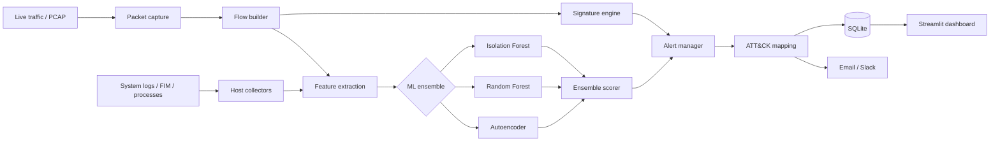

# Hybrid ML Intrusion Detection System

Real-time intrusion detection that combines network and host monitoring with a four-model machine learning ensemble, and maps every alert to a MITRE ATT&CK technique so triage takes seconds instead of minutes.

[**Live demo**](https://huggingface.co/spaces/vikrant892/ids-project) · [Runbook](docs/runbook.md) · [MITRE mapping](docs/mitre_mapping.md)

---

## Why this exists

Most detection tools give you an alert and leave you to work out what it means. Signature engines miss anything they have not seen before, and pure anomaly detection drowns you in false positives. This system runs both, then labels the result with the ATT&CK technique it corresponds to, so an analyst opens an alert already knowing what class of attack they are looking at.

## What it does

- **Network detection (NIDS)** — live packet capture, flow reconstruction and signature matching
- **Host detection (HIDS)** — log parsing, file integrity monitoring and process monitoring
- **Four-model ML ensemble** — Isolation Forest, Random Forest and an Autoencoder, combined by an ensemble scorer
- **ATT&CK mapping** — 12 techniques covered, from port scans to sudo abuse
- **Alerting** — email and Slack notifiers with a structured alert manager
- **Streamlit dashboard** — live alert feed backed by SQLite

## Architecture



## Detection coverage

| Technique | Name | Layer |
|---|---|---|
| T1046 | Network Service Discovery (port scan) | Network |
| T1499 | Endpoint Denial of Service (SYN flood) | Network |
| T1498 | Network Denial of Service (ICMP flood) | Network |
| T1498.002 | Reflection Amplification (DNS) | Network |
| T1071 | Application Layer Protocol (C2 ports) | Network |
| T1190 | Exploit Public-Facing Application | Network |
| T1110 | Brute Force | Network |
| T1110.001 | Password Guessing (SSH) | Network |
| T1548.003 | Sudo and Sudo Caching Abuse | Host |
| T1136 | Create Account | Host |
| T1565 | Data Manipulation (file tampering) | Host |
| T1059 | Command and Scripting Interpreter | Host |

## Evaluation

Models are evaluated against [CICIDS2017](https://www.unb.ca/cic/datasets/ids-2017.html) on a held-out test split. `src/ml/train.py` reports precision, recall, F1 and ROC-AUC for each of the three models and for the combined ensemble, using `sklearn.metrics` with the attack class as the positive label.

To reproduce:

```bash
# 1. Download the CICIDS2017 CSVs and place them in data/raw/
# 2. Train and evaluate
train.bat
```

The classification report and ROC-AUC for every model print to stdout at the end of training.

> **On synthetic data:** if `data/raw/` is empty, training generates synthetic traffic so the pipeline can be smoke-tested end to end. Those runs verify that the plumbing works — they are not a measure of detection quality, and the scores they produce should not be quoted as such. Use the real CICIDS2017 CSVs for any figure you intend to rely on.

## Tech stack

Python 3.11 · scikit-learn · PyTorch · Scapy · Streamlit · SQLite · pytest

## Quick start

Windows, no Docker required.

```bash
git clone https://github.com/Vikrant892/ids-project.git
cd ids-project
setup.bat                  # venv, dependencies, database init
generate_test_pcap.bat     # synthetic PCAP if you have no live traffic
train.bat                  # train the ensemble (5-10 min)
start.bat                  # run the IDS engine (Administrator for live capture)
dashboard.bat              # dashboard at http://localhost:8501
test.bat                   # unit, integration and simulation tests
```

For real results, place the CICIDS2017 CSVs in `data/raw/` before running `train.bat`.

## Project layout

```
src/
├── nids/        packet capture, flow builder, signatures
├── hids/        log parser, file integrity monitoring, process monitor
├── ml/          Isolation Forest, Random Forest, Autoencoder, ensemble
├── alerts/      alert manager, email and Slack notifiers
├── dashboard/   Streamlit app
└── utils/       config, database, logging
tests/           unit, integration, simulation
docs/            runbook, MITRE mapping
```

## Troubleshooting

| Problem | Fix |
|---|---|
| `scapy` install fails | `pip install scapy --pre` |
| Live capture permission denied | Run `start.bat` as Administrator |
| `No module named src` | Run from inside the `ids-project` folder |
| Models not found | Run `train.bat` first |
| Port 8501 in use | Change `--server.port` in `dashboard.bat` |
| Torch install slow | Expected, PyTorch is around 2GB |

## Licence

MIT — see [LICENSE](LICENSE).

---

Built by [Vikrant Sharma](https://vikrant69g.com) · Master of Information and Communication Technology, University of the Sunshine Coast
